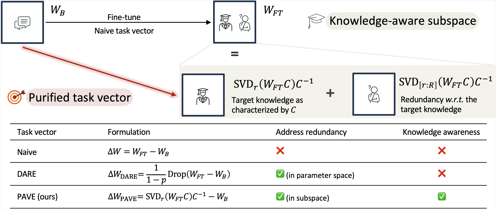

<h1 align="center">Purifying Task Vectors in Knowledge-Aware Subspace for Model Merging</h1>

This is the official implementation of our paper **Purifying Task Vectors in Knowledge-Aware Subspace for Model Merging** ([arxiv](https://arxiv.org/abs/2510.14697)).

We provide the code for merging on [GLUE benchmarks](./GLUE) (including RoBERTa and DeBERTa), [NLG tasks](./NLG), and [ViT models](./ViT).

Our implementation is based on the code below. We appreciate their contribution.

- DARE: https://github.com/yule-BUAA/MergeLM

- Task Arithmetic: https://github.com/mlfoundations/task_vectors

- TIES-MERGING: https://github.com/prateeky2806/ties-merging/tree/main

- EMR-Merging: https://github.com/harveyhuang18/EMR_Merging/tree/main
